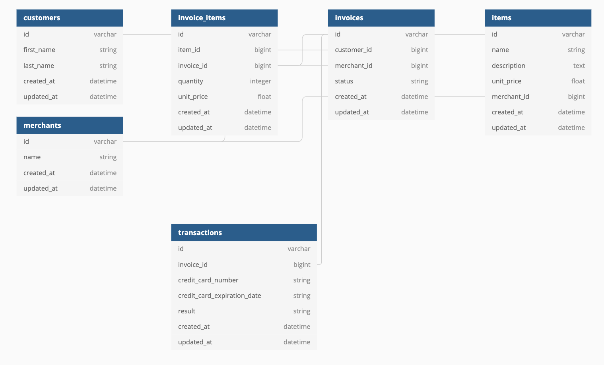

# Rails Engine

<!-- PROJECT SHIELDS -->
[![Contributors][contributors-shield]][contributors-url]
[![Forks][forks-shield]][forks-url]
[![Stargazers][stars-shield]][stars-url]
[![Issues][issues-shield]][issues-url]


<!-- PROJECT LOGO photo
  Add path to photo from app/assets/images
<br />
<p align="center">
  <a href="https://github.com/ETBassist/viewing_party">
    
  </a> -->

  <h3 align="center">Rails Engine</h3>

  <p align="center">
    Rails Engine is a backend application providing fully tested API endpoints that powers a fictitious E-commerce application.
    <br />
    <a href="https://github.com/Jonathan-M-Wilson/rails-engine"><strong>Explore the docs »</strong></a>
    <br />
    <br />
    <!-- for adding a demo video
    <a href="Add our video link here">View Demo</a>  · -->
    ·
    <a href="https://github.com/Jonathan-M-Wilson/rails-engine/issues">Report Bug</a>
    ·
    <a href="https://github.com/Jonathan-M-Wilson/rails-engine/issues">Request Feature</a>
  </p>
</p>


<!-- TABLE OF CONTENTS -->
## Table of Contents

* [About the Project](#about-the-project)
  * [Built With](#built-with)
* [Getting Started](#getting-started)
  * [Prerequisites](#prerequisites)
  * [Configuration](#configuration)
  * [Testing](#testing)
  * [Schema](#schema)
  * [Endpoints](#endpoints)
* [Roadmap](#roadmap)
* [Contributing](#contributing)
* [Contact](#contact)
* [Acknowledgements](#acknowledgements)


<!-- ABOUT THE PROJECT -->
## About The Project

Rails Engine is a backend application providing fully tested API endpoints that powers a fictitious E-commerce application. Merchants have full CRUD functionality for their inventory, including business intelligence endpoints such as finding merchants with the most revenue, merchants with most items sold, revenue across a date range, and the total revenue for a single merchant.

This application exposes 20 RESTful endpoints. The statistical data provided through the business intelligence endpoints were calculated by analyzing over 4000 records of data. Rails Engine is backed by a PostgreSQL database, using ActiveRecord for an ORM as well as Fast_jsonapi for serialization.


### Built With

* [Ruby](https://github.com/ruby/ruby)
* [Rails](https://github.com/rails/rails)


<!-- GETTING STARTED -->
## Getting Started

To use Rails Engine locally, you can fork or clone [this](https://github.com/Jonathan-M-Wilson/rails-engine) repo.


### Configuration

1. ```git clone git@github.com:Jonathan-M-Wilson/rails-engine.git```
2. ```cd rails_engine```
3. ```bundle install```
4. ```rake db:{create,migrate,seed}```
5. ```bundle exec rspec to run the test suite```


### Testing

Rails Engine has been fully tested. To view the test coverage;

Once inside your terminal within the Rails Engine directory run the following command.
```
open coverage
```

This will open up a folder with an index.html file. Clicking on this file will show you a list of all lines of code within this project, and whether they have been tested or not.

Additionally, running ```bundle exec rspec``` will show you the quick summary of the test coverage in this application.


### Schema

After running your migrations, your schema will look something like this!
<br />
<p align="center">
    
</p>


### Endpoints
Below are listed some examples of the endpoints within Rails Engine. To see all endpoint available, please checkout the [docs](https://github.com/Jonathan-M-Wilson/rails-engine)!


##### GET /merchants
List of all merchants recorded in the database

response
```
{
    "data": [
        {
            "id": "1",
            "type": "merchant",
            "attributes": {
                "name": "Schroeder-Jerde"
            }
        },
        {
            "id": "2",
            "type": "merchant",
            "attributes": {
                "name": "Klein, Rempel and Jones"
            }
        }
    ]
}
```


##### GET /merchants/1
Information about a specific merchant
```
{
    "data": {
        "id": "1",
        "type": "merchant",
        "attributes": {
            "name": "Schroeder-Jerde"
        }
    }
}
```


##### Get /merchants/5/revenue
Total revenue for a specified merchant.
```
{
    "data": {
        "id": null,
        "type": "revenue",
        "attributes": {
            "revenue": 714320.6700000002
        }
    }
}
```

<!-- ROADMAP -->
## Roadmap

See the [open issues](https://github.com/Jonathan-M-Wilson/rails-engine/issues) for a list of proposed features, known issues, and project extensions.


<!-- CONTRIBUTING -->
## Contributing

Contributions are what make this community such an amazing and fun place to learn, grow, and create! Any contributions you make are **greatly appreciated**.

1. Fork the Project
2. Create your Feature Branch ```git checkout -b feature/NewGreatFeature```
3. Commit your Changes ```git commit -m 'Add some NewGreatFeature'```
4. Push to the Branch ```git push origin feature/NewGreatFeature```
5. Open a new Pull Request!


<!-- CONTACT -->
## Contact

Jonathan Wilson - [![LinkedIn][linkedin-shield]](https://www.linkedin.com/in/jonathan--wilson/) - [GitHub](https://github.com/Jonathan-M-Wilson)


Project Link: [Rails Engine](https://github.com/Jonathan-M-Wilson/rails-engine)


<!-- ACKNOWLEDGEMENTS -->
<!-- Add resources that were used to help create this project here -->


<!-- MARKDOWN LINKS & IMAGES -->
[contributors-shield]: https://img.shields.io/github/contributors/Jonathan-M-Wilson/rails-engine
[contributors-url]: https://github.com/Jonathan-M-Wilson/rails-engine/graphs/contributors
[forks-shield]: https://img.shields.io/github/forks/Jonathan-M-Wilson/rails-engine
[forks-url]: https://github.com/Jonathan-M-Wilson/rails-engine/network/members
[stars-shield]: https://img.shields.io/github/stars/Jonathan-M-Wilson/rails-engine
[stars-url]: https://github.com/Jonathan-M-Wilson/rails-engine/stargazers
[issues-shield]: https://img.shields.io/github/issues/Jonathan-M-Wilson/rails-engine
[issues-url]: https://github.com/Jonathan-M-Wilson/rails-engine/issues
[linkedin-shield]: https://img.shields.io/badge/-LinkedIn-black.svg?style=flat-square&logo=linkedin&colorB=555
[about-screenshot]: images/screenshot.png
[dashboard-screenshot]: images/screenshot.png
[movies-screenshot]: images/screenshot.png
[viewing-party-form-screenshot]: images/screenshot.png
